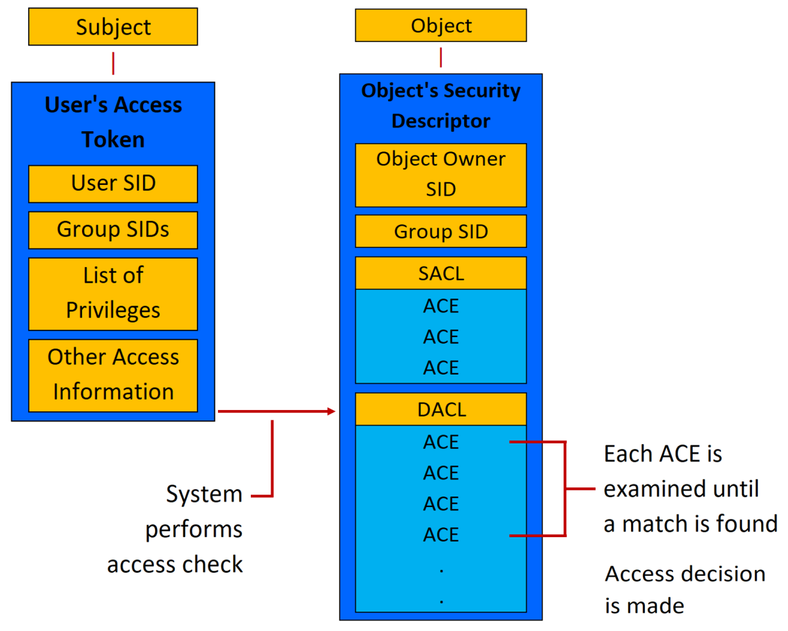
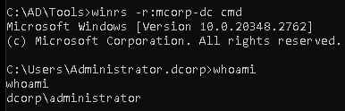

# A Hash Never Lies...right?
As part of my CRTP studies, I've been trying to get more involved in the Altered Security discord server and help answer other students' questions. I've found this has been a great way for me to test my own understanding of the material while giving back to the community. One night, another user was having issues with a silver ticket attack. They had pulled the machine account hash, done all the commands properly, and still were unable to access the resources they should have had access to. How could this be? 

We'll answer that question in a bit, but first let's make sure we're all on the same page.

# An Intro to SIDs and RIDs

To understand SIDs and RIDs, we must first start by understanding Security Principals. Noted by Microsoft as being the foundation to access control in Windows, Security Principals are "any entity that can be authenticated by the operating system, such as a user account, a computer account, or the security groups for these accounts". These entities are each represented by a unique Security Identifier, which is stored in the Security Accounts Manager (SAM, for local accounts) or the Global Catalog (GC, for Active Directory) for the duration of their lifetime. These SIDs are passed during the authentication process through access tokens, which contains the SID of a user and of all group memberships for the user. These can be referenced against individual Access Control Entities (ACEs) that make up an Access Control List (ACL). 

_A diagram of the Windows access control methodology, courtesy of Microsoft_

## SID and RID Structure and Common Identifiers
Let's use the following SIDs as examples: `S-1-5-21-1004336348-1177238915-682003330-512` and `S-1-5-14`

SIDS are follow the format `S-R-X-Y1-Y2-...Yn`, with each value representing the following:  
* `S` - Signifies that string is a SID
* `R` - The revision level (virtually always 1)
* `X` - The identifier authority value (Most commonly 5, or `SECURITY_NT_AUTHORITY`)
* `Y` - A series of subauthorities, which can be a single or multiple values

AS we can see, the first few parts of our example SID line up quite well with the formula we've outlined. But how about everything after `S-1-5`? Well, our next useful value is `21-1004336348-1177238915-682003330`. This value represents the unique identifier for our domain (in this case, the classic `contoso.com`). The final trailing `Y` value, in this case `512 ` is what is known a Relative Identifier (RID). RIDs help identify one account from another on a local computer or domain. These RIDs are unique to each host and domain, and no single RID can be reused, even after a user is deleted. 

You may notice that our second SID's RID comes directly after it's authority value and lacks a domain value. These SIDs are part of the Special Identities Group, which you can read more about [here](https://learn.microsoft.com/en-us/windows-server/identity/ad-ds/manage/understand-special-identities-groups). These groups can be assigned rights and permissions to resources, but, unlike other domain and local groups, cannot have their membership modified. Their membership is based on specific circumstances and state conditions within a local system or domain, so users and computers are automatically assigned to these groups as those conditions are met.


As red teamers, there are a number of accounts that we should be familiar with. Thankfully, Microsoft has a pretty good reference available [here](https://learn.microsoft.com/en-us/windows-server/identity/ad-ds/manage/understand-security-identifiers) (along with plenty of reference material for SIDs in general). Some common ones that you may want to take note of are the following:

* `S-1-5-9` - Enterprise Domain Controllers
* `S-1-5-18` - `NT AUTHORITY\SYSTEM` user (or `LocalSystem`)
* `S-1-5-domain-500` - Administrator user (for Domain and Local level)
* `S-1-5-domain-502` - KRBTGT user
* `S-1-5-domain-512` - Domain Administrators group
* `S-1-5-domain-516` - Domain Controllers group
* `S-1-5-root domain-519` - Enterprise Administrators group
:::note
This is a very surface-level list - there are plenty more interesting SIDs!
:::

# Red Team Use Cases
Now that we've done a brief over of what SIDs and RIDs are and how they work, let's take a look at a few use cases where red teamers may leverage or exploit these values for their own gain.

## SID History and SID filtering
`SIDHistory`is an Active Directory account attribute that supports migrations within an Active Directory environment. This is useful when migrating users form one domain to another, as it will ensure that the access they had to previous resources will not be removed by notating their previous domain's SID in the `SIDHistory` property. While this is a useful feature for such scenarios, it can also be leveraged for malicious reasons. Since Kerberos validation is typically limited to "can the KDC decrypt the TGT", threat actors are able to pass SIDs as part of the `SIDHistory` within the PAC of the TGT, we can escalate from a Domain Administrator to an Enterprise Administrator. An example `Rubeus` command would be as follows:

```
Rubeus.exe evasive-golden /user:Administrator /id:500 /domain:dollarcorp.moneycorp.local /sid:S-1-5-<DOMAIN> /sids:S-1-5-<ROOT_DOMAIN>-519 /aes256:<KRBTGT_AES> /netbios:dcorp /ptt
```
Then with this ticket, we can access an enterprise domain controller (in this case, `mcorp-dc.moneycorp.local`).



For more on this, please check out Sean Metcalf's blog post [here](https://adsecurity.org/?p=1640).

## RID Bruteforcing/Cycling
With domain-specific RIDs starting at the number 500 (and only increasing), they can be bruteforced to provide threat actors with a list of SIDs and account names for each. Most tooling built to conduct RID bruteforcing leverage RPC over SMB and null sessions. As Dave Kennedy from TrustedSec discusses [here](https://www.trustedsec.com/blog/new-tool-release-rpc_enum-rid-cycling-attack), a null session is simply an SMB session with no username or password provided. By scripting out the usage of an RPC client, like the aptly named `rpcclient`, a tool can connect to a share that accepts null sessions and execute commands such as `lookupsids S-1-2-<DOMAIN>-<RID>` for hundreds to tens of thousands of RID values and acquire their corresponding accounts. 

Historically, pentesters and red teamers have flocked to the `IPC$` share as an "in" to null session enumeration. This is something that Microsoft is [well aware of](https://techcommunity.microsoft.com/blog/filecab/smb-and-null-sessions-why-your-pen-test-is-probably-wrong/1185365), so don't be surprised if you aren't able to pull this off in your own tests. 

## RID Hijacking
For a more recent example of RID exploitation, we can look at attacks earlier this year by Andariel, a subset of the Lazarus Group APT. In their attacks, Andariel utilizes a method known as RID hijacking in order to achieve persistent high privileges through hidden accounts. As detailed in [this blog post](https://asec.ahnlab.com/en/85942/) by AhnLab's ASEC, Andariel utilized custom malware and open source tooling to achieve `SYSTEM` privileges, create "hidden accounts" (effectively machine accounts), and modify the registry value under path `HKEY_LOCAL_MACHINE\SAM\SAM\Domains\Account\Users\<AccountName>`. This registry change causes the RID for that account to be the same as a high-privileged user (ie: `Administrator`), thus providing that account persistent high permissions. 

# Attack of the Clones
Let's get back to how this all started - a failed silver ticket attack. In this scenario, the goal was to remote into a server using `winrs` by getting a silver ticket for that host's `http` service. So to catch up with him, I went and did a quick DCSync attack to compare his machine account's AES hash with my own. Surprisingly, the two hashes were different. 

I double-checked with the student and they assured me they had the hash for the correct machine. Suddenly, my spidey-sense started tingling. I remembered something Nikhil (owner of Altered Security and CRTP instructor) had mentioned regarding machine accounts.  

## Virtual Accounts
Microsoft introduced the concept of "virtual accounts" back during the Windows 7 era (if Wikipedia is to be believed). These virtual accounts are the local cousin of your typical domain-bound managed service accounts (such as sMSAs, gMSAs, and the new dMSAs) - they are automatically managed by the operating system to simplify service deployment and management. Virtual accounts can be identified through their naming scheme of `NT SERVICE\<ServiceName>`. As Andrew Mayo points out in his blog post [here](https://www.1e.com/blogs/accounts-everywhere-part-1/), you can also identify virtual accounts by a variety of SIDs, such as:

* `S-1-5-82`
* `S-1-5-90-0`
* `S-1-5-90-1`
* `S-1-5-90-2`
* `S-1-5-96-0-n` (where `n` is a number, potentially 2)

## Finding "True" Machine Accounts
In order to find the "true" machine account (one that isn't a virtual account), we simply need to find an SID for a security principal that uses the machine account's credentials. According to Microsoft's SID documentation I referenced earlier (and more clearly by this StackOverflow answer [here](https://stackoverflow.com/questions/510170/the-difference-between-the-local-system-account-and-the-network-service-acco)), SIDs `S-1-5-18` (aka `LocalSystem`) and `S-1-5-20` (aka `NetworkService`) both utilize the local machine account's credentials when they are required to authenticate. When looking at the output of my LSASS dump from SafetyKatz, I was able to confirm that both AES256 hashes matched and were different from all other virtual machine accounts in the output. 

One thing to note is that there is another SID smack dab in the middle of the two we mentioned above - `S-1-5-19`. As the StackOverflow answer notes, this account is for the `LocalService` account. This account is an intentionally low-privileged account that has minimal privileges on a local system and very little privileges across the network. This highlights the need for understanding of specific SID values, as an uninformed Red Teamer may assume this provides a correct hash and spend minutes or hours wondering why their fancy new silver ticket isn't working. 

Another interesting identifier for likely "real" machine accounts is their logon date. For all the virtual accounts, I found that they had all been logged in for around 12-16 hours or less, while `LocalSystem` and `NetworkService` had been around for months. I compared this with my own lab machine and after rebooting, as expected

So, did this solve the problem? You be it did. The student was able to grab the right hash, form a TGS/ST with them, and successfully login to the host. Mystery solved!

```
Authentication Id : 0 ; 27860 (00000000:00006cd4)
Session           : Interactive from 1
User Name         : UMFD-1
Domain            : Font Driver Host
Logon Server      : (null)
Logon Time        : 1/15/2025 2:57:40 AM
SID               : S-1-5-96-0-1

         * Username : DCORP-DC$
         * Domain   : dollarcorp.moneycorp.local
         * Password : 54 15 1e 36 fd 0a af af 2a [snip]
         * Key List :
           aes256_hmac       983237a2a0b9c52453911c0eaf2fa7bd20df046a834384c5e0d396826dd6abe8
           aes128_hmac       3a8b1c50e95780d4080cfa265cca27df
           rc4_hmac_nt       d316cf5d2ff24bc4f5859073ec0e4796
           rc4_hmac_old      d316cf5d2ff24bc4f5859073ec0e4796
           rc4_md4           d316cf5d2ff24bc4f5859073ec0e4796
           rc4_hmac_nt_exp   d316cf5d2ff24bc4f5859073ec0e4796
           rc4_hmac_old_exp  d316cf5d2ff24bc4f5859073ec0e4796

Authentication Id : 0 ; 999 (00000000:000003e7)
Session           : UndefinedLogonType from 0
User Name         : DCORP-DC$
Domain            : dcorp
Logon Server      : (null)
Logon Time        : 1/15/2025 2:57:36 AM
SID               : S-1-5-18

         * Username : dcorp-dc$
         * Domain   : DOLLARCORP.MONEYCORP.LOCAL
         * Password : (null)
         * Key List :
           aes256_hmac       a100fd2387d8b17334f09548edf1dde844b176770772df7077ff1fcd87952e8a
           rc4_hmac_nt       d316cf5d2ff24bc4f5859073ec0e4796
           rc4_hmac_old      d316cf5d2ff24bc4f5859073ec0e4796
           rc4_md4           d316cf5d2ff24bc4f5859073ec0e4796
           rc4_hmac_nt_exp   d316cf5d2ff24bc4f5859073ec0e4796
           rc4_hmac_old_exp  d316cf5d2ff24bc4f5859073ec0e4796
```

:::note
While all of the virtual accounts have invalid AES256 hashes, I did come across something interesting. I found that _some_ virtual accounts have the same NTLM hash as the "real" machine account (see above code block), while others have an older NTLM hash of the "real" account (when compared to previous passwords from a dcsync attack). I cannot find any documentation about why this. From what I can tell, this really doesn't affect much of anything, but I figured it was worth mentioning. If you know more, hit me up!
:::

# Conclusion
SIDs and RIDs are not only a crucial part of the Windows security model, but can be a handy tool for red teamers to identify and exploit. As always, I appreciate any and all feedback or questions you may have. The best way to reach me is through LinkedIn or through Discord (LabManSec). Until next time, thanks for stopping by The Lab™ and happy hacking!

## References

[Security Principals (MSFT)](https://learn.microsoft.com/en-us/windows-server/identity/ad-ds/manage/understand-security-principals)

[SID/RID Reference (MSFT)](https://learn.microsoft.com/en-us/windows-server/identity/ad-ds/manage/understand-security-identifiers)

[SIDHistory (MSFT)](https://learn.microsoft.com/en-us/defender-for-identity/security-assessment-unsecure-sid-history-attribute)

[IPC$ and Named Pipes](https://learn.microsoft.com/en-us/troubleshoot/windows-server/networking/inter-process-communication-share-null-session)

[Virtual Accounts (MSFT)](https://learn.microsoft.com/en-us/windows-server/identity/ad-ds/manage/understand-service-accounts#virtual-accounts)
