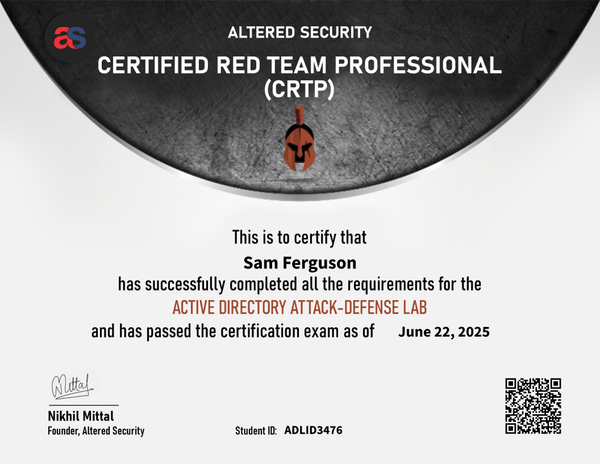

I'm pretty excited about this one.

Recently, I earned my very first red team (and, by extension, cybersecurity) certification by passing the [Certified Red Team Professional](https://www.alteredsecurity.com/adlab) (CRTP) exam by Altered Security. This certification seeks to provide "a platform for security professionals to understand, analyze and practice threats and attacks in a modern Active Directory environment". The course is taught by Nikhil Mittal (whom you may know as the creator of Nishang), founder of Altered Security. 

Before I get started, I want to give a big shoutout to my colleague [Jared](https://www.linkedin.com/in/jaredallentackett/). He was also studying for (and passed!) CRTP while I was doing my studies, and we were able to bounce questions and ideas off of each other during our studies.

# The Course

The course has two main components - the course content and the lab environment. When purchasing the course, students receive lifetime access to all course content, but lab access is limited to either 30, 60, or 90-day periods based on the tier students purchase. Lab time can be started any time within 90 days of purchase, giving students ample time to start reviewing content before diving into the labs. For this course, I purchased the 60-day lab time (though I could have done fine with 30, more on that later).

The course content itself is spread across thirteen sections, covering topics such as numeration basics, tradecraft fundamentals, common AD-based attacks, AD and other feature-related attacks, and detection/prevention opportunities related to attack vectors. The course content is available in both a PowerPoint and video format, with the video being a recording of one of Altered Security's course bootcamps that they conduct throughout the year. The slides mention that not all content is covered in the slides, and I can personally attest to that - there were some pretty useful tidbits of information that Nikhil shared throughout the videos that were nowhere to be found in the slides. The videos are easy to follow - I actually bumped some of them up to 1.2x to 1.5x speed to get through them a bit quicker as I was able to still process the information accurately at those speeds. For those of you who want to access the videos on the go, don't forget that you can download the videos by clicking the button near the top left corner of each video's page. 

The lab environment contains multiple servers and domain controllers spread across multiple domains and forests, though much of the labs focus on a single domain. This lab environment is accessible either via Guacamole or via VPN + RDP (which I would personally recommend). Along with the lab environment is a lab manual and flag entry system. The lab manual comes in two versions - a "standard" version using a collection of publicly available tools, and a "C2" version that leverages the Sliver C2 framework for executing tasks. As you complete tasks in the lab manual, you will find answers to the different questions in the flag verification section of the course site. Completing all questions will earn you a verifiable credential for pwning the AD Lab environment.  

I felt that the environment was generally pretty solid. As mentioned above, I highly recommend using the VPN credentials + an RDP client (if you're on Linux, look at Remmina) as it made sharing files much more straightforward. Some attacks in the environment, mainly against the DCs, were a bit hit-or-miss for one reason or another. Thankfully, the team at Altered Security refreshes the lab environment daily so your issues are often resolved pretty quickly. They're also available for questions via email or Discord, and they can help verify if an issue is on your end or something with the platform. The lab manual is out of date/incorrect in some places, but most issues that exist are just minor differences in naming conventions (they changed their naming conventions for computers at one point, which isn't always reflected in the lab manual) and a few example hashes being incorrect (due to password rotations). Just pay attention to those naming convention differences and make sure to notate various hash values as you find them and you should be good to go. As for the flag verification, the vast majority of questions were pretty cut-and-dry as to what the answer was. There were only a few confusing ones, but you can always ask for pointers in the Altered Security Discord if you're a bit lost.

## Recommendations - Course
**Don't immediately start your lab time**: After doing this course, I'm likely going to complete future courses by running through all of the content once to absorb as much information as I can. After that, I'll make a second "sprint" through the content while completing the labs along the way. This is a recommendation I've seen others give and after my experience with CRTP, I definitely can see why. I'll report back after I've tried this method, but I certainly think it has merit.

**Do your own research/learning**: Let me be very clear - CRTP is great and chock-full of wonderful content, but it simply cannot cover everything. From the nitty-gritty of Kerberos functionality to underlying Active Directory systems, extra research and learning on your end can go a long way when it comes to complete understanding of the systems that you'll be targeting and the attacks you'll be executing.

**If you're new(er) to attacking AD, avoid the C2 lab manual**: CRTP gives students the option of using Sliver C2 to execute the lab objectives. If you've already done AD red teaming/offensive security before, this could certainly be a good way to keep the course interesting while you search for the bits and pieces of info that are new or a refresher for you. But if you're newer to hands-on AD testing, stick to using the tools provided in the course without touching Sliver to focus your mental bandwidth no techniques as opposed to tools.

**Get involved in the AS Discord**: Towards the end of my studying, I started getting more active in Altered Security's Discord server, where they have a channel for each cert's students to ask questions. I spent a lot of nights helping answer other students' questions and troubleshooting their issues. Not only was this a great way to give back to the community, but it also challenged my knowledge and ability to explain concepts to others. 

# The Exam

I'll be completely honest, I was quite stressed for this exam. I spent about two weeks or so re-running some of the lab activities to ensure that I understood both how to technically execute attacks and how/why those attacks worked. I prepared a runbook of commands to reference during the exam, and I spent some time reviewing course topics that hadn't quite clicked conceptually. About 1 week into my preparation, I made the decision to commit to taking the exam on the next weekend coming up. You get 24 hours to complete the exam, so I decided to begin my exam around 2 PM in the afternoon on Saturday. My hope was that I would be able to complete the exam in 8-10 hours (barring any technical issues), and at worst I could hopefully get through 3 or 4 machines before heading to bed and trying to crack the last 1-2 machines in the morning.

Thankfully, it only took me about 6 hours to complete the exam (from full tool upload to all objectives completed). I felt like the exam difficulty was about equivalent to that of the course difficulty. If you make the effort to really understand the course content and put in some time to understand underlying systems, achieving all the objectives should be relatively easy. There were only two portions of the exam I found particularly difficult. One was challenging because I couldn't think of the easy solution in the moment, but eventually got to it and thought "wow, I could have saved myself 30 minutes if I had thought about this situation beforehand". The other challenging portion was caused by a technical issue that pushed me to an alternate attack path that wasn't directly covered in the course, but is something a student who took the time to dive into the course content could have reasoned as a potential attack path. 

With the exam complete, I gathered up my screenshots and utilized an online reporting template from redteam.guides ([here](https://redteam.guide/docs/Templates/report_template/)) as a base for my own report's template. I pulled the markdown from this sample template into [Obsidian](https://obsidian.md/), then used the Obsidian plugin `Pandoc` by Olivier Balfour to convert the completed report to LaTex. I opened the generated `.tex` file in VSCode (which has both the LTeX spell checker and LaTeX Workshop extensions installed) to generate and modify my final PDF. By late Monday/early Tuesday, I had completed my exam report and sent it for review. On Friday, I received word from the Altered Security team that I had officially passed the exam!

## Recommendations - Exam
**Read the exam instructions!**: The exam makes multiple warnings that students should take to heart. While you may have a tool of choice for each attack, have a backup ready to go in case you have any technical issues with how your tooling choice interacts with the exam environment. 

**Practice, practice, practice**: Run through the labs a few more times after fully completing the AD Lab. Make sure you understand how your primary and backup tools work. Understand the conditions that are required for a certain attack to work. Test out some theories or questions you have, as you may discover alternative attack paths that could be useful. 

**Build a runbook**: As I practiced, I built out my own runbook that detailed the different commands that can be executed depending on the stage of the engagement that you're at. This is a pretty standard practice for red teaming, and for good reason - it limits the mental energy you have to spend remembering which commands to use when and lets you spend more time focusing on the unique problems you have to solve with each unique engagement. So do some research, take inspiration from runbooks on the Internet, and structure out your own runbook to fit your thought process. Ironically, you may end up not needing it as much on the exam since building it may have drilled that process into your head.

**If at first you don't succeed, try, try again**: This is advice is a bit generic, but I think for the offensive side its particularly relevant. There were some tools that seemed like they straight up didn't work for 10-15 minutes, then seemingly out of nowhere started working just fine. Logout/login, close and reopen, or just wait if absolutely necessary and you may find some of your issues resolved. I had a buddy of mine deal with a technical issue for 6 hours just for it to suddenly start working (shoutout again to Jared, absolute trooper for that). 

**If you think you have enough screenshots, no, you don't**: Remember that you need screenshots for every relevant command output in your report. I'd even go so far as to recommending taking screenshots of your inputs of your commands as well. I personally erred on the side of over-reporting as opposed to under-reporting, though I'm not sure how realistic that is compared to a true red team report.

**Be prepared to do extra digging for your report**: This could very well be a "Sam the recovering perfectionist" issue, so take this advice with a grain of salt. On my report, there were a few sections for attack vectors I felt like I just wasn't going deep enough on when it came to technical explanations. I spent a bit of extra time during the reporting time researching these attacks to ensure I had my explanations rock solid, and while I have no idea how that impacted my exam score, I am glad I did it - it gave peace of mind when I submitted my report and solidified or improved my knowledge on certain topics.

**Prepare your reporting template beforehand**: If you're looking for a good one, feel free to check out my LaTeX template [here](https://github.com/LabManSec/Report-Template/). This report is heavily inspired by the redteam.guide reporting template I mentioned above. My template serves more of a structural purpose, as it focuses less on the content itself and more on the ability for LaTeX to provide clean formatting. The redteam.guide template provides some guidelines for the layout, but is much more helpful for those wanting samples of the type of content or wording that should go into a red team report. Of course, there are plenty more templates to use 

**Trust in yourself and stay focused**: As I mentioned before, this exam is about as hard as the course content is. If you've studied hard and truly understand the content, you can and will pass this exam. Even if things feel like they're going off track, take a quick break, take stock of what information you've gathered during the exam', and lean on your training to find reasonable next steps. This exam is as much about your technical capabilities as it as your ability to stay mentally focused and confident in yourself - don't let the pressure get to you!

# My Overall Thoughts

Overall, I enjoyed the CRTP experience. Coming from a technical background and having a solid understanding of the basics of Windows and Active Directory helped a lot, and I think if I had managed my time better I could have knocked this out in the 30-day lab window rather than the 60-day lab window I purchased. If you have no/minimal Windows or AD exposure beforehand, you may find this course challenging and have to put in a good amount of extra effort to ensure you understand all the underlying concepts and systems, but I do think it is doable if that is what your current background is. 

I would absolutely recommend this course to any aspiring red teamers out there or to any defenders who want to better understand that attack vectors that environments using AD face. 

## What's Next?

I've done a bit of research and asked around with some of the professional red teamers in my circle, and it seems like the best next step will be Altered Security's CRTE. The Certified Red Team Expert course and exam are the next step after CRTP, diving into more intermediate and advanced AD attack paths and introducing students to some defense evasion and deception concepts. After that, I'll be moving to the CRTO by Zero Point Security to learn about C2 operations with Cobalt Strike. In between cert grinds, I'll be working on my Windows Internals skills (including learning a bit more of C) and keep my brain locked in on testing with some HTB here and there.

As always, all comments, questions, and feedback is much appreciated! Feel free to drop me a line on LinkedIn or on Discord, always happy to chat with other infosec professionals. Until next time, thanks for coming to The Lab™.